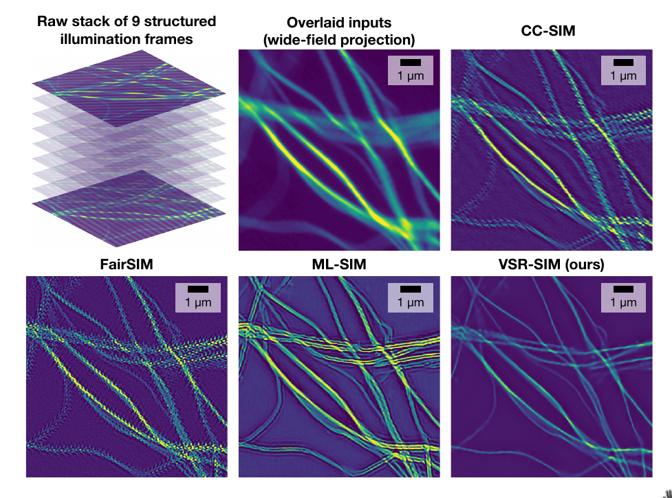

# VSR-SIM

**VSR-SIM: Spatio-temporal Vision Transformer for Super-resolution Microscopy**


_Charles N. Christensen<sup>1,2,*</sup>, Meng Lu<sup>1</sup>, Edward N. Ward<sup>1</sup>, Pietro Lio<sup>2</sup>, Clemens F. Kaminski_</br></br>
<sup>1</sup>University of Cambridge, Department of Chemical Engineering and Biotechnology, Laser Analytics Group</br>
<sup>2</sup>University of Cambridge, Department of Computer Science and Technology, Artificial Intelligence Group</br>
<sup> *</sup>**Author of this repository**:
- GitHub: [charlesnchr](http://github.com/charlesnchr)
- Email: <code>charles.n.chr@gmail.com</code>
- Twitter: [charlesnchr](https://twitter.com/charlesnchr)

## Introduction

Reconstruction method for **V**ideo **S**uper-**R**esolution **S**tructured **I**llumination **M**icroscopy (VSR-SIM) using a vision transformer architecture. 

The method is trained using synthesised video data based on a SIM image formation model and a dataset of nature documentaries for diverse and varied image data.

Being a video super-resolution method, VSR-SIM is inherently robust to significant levels of motion in input data as illustrated below.



## VSR-SIM Publications
### Journal Publication, 2022
Currently under review as of February 2022.

### Pre-print manuscript, Feburary 2022
https://arxiv.org/abs/2203.00030


## Layout of repository

- Powershell script for video dataset sampling:
    - `scripts/sample_documentary_videos.ps1`
- Python code for image formation model:
    - `scripts/im_form_model/SIMulator.py`
- Data generation script:
    - `scripts/datagen_pipeline.py`
- Model architecture based on Pytorch:
    - `basicsr/archs/vsr-sim_arch.py`
- Training code:
    - `basicsr/train.py`
- Inference code for testing:
    - `inference/inference_options.py`
- RBPN code base based on official implementation:
    - `RBPN-PyTorch`

## Installation of environment
See `requirements.txt` for all the required packages. They can be installed with pip using
```
pip install -r requirements.txt
```
It is recommended to use Anaconda to make a virtual environment and for installation of Pytorch so that the CUDA drivers are installed automatically. The following snippet should install everything necessary:
```
conda create -n vsrsim python=3.8
conda activate vsrsim
conda install pytorch torchvision torchaudio cudatoolkit=11.3 -c pytorch
pip install scikit-image matplotlib scipy opencv-python tqdm timm pyyaml einops torchsummary
```

## Video sampling

Given a collection of .mp4 and .mkv video containers, we use the FFMPEG library to sample the collection with a time interval of 5 seconds between sequences. The script is launched using Powershell with

```
pwsh scripts/sample_documentary_videos.ps1
```


## Data generation
The image formation pipeline can be used as follows
```
python datagen_pipeline.py --root TRAINING_DATA_DIRECTORY \
    --sourceimages_path SAMPLED_IMAGE_SEQUENCE_DIRECTORY --nrep 1\
    --datagen_workers 10 --imageSize 512  --nch_in 9 --nch_out 1\
    --ntrain 100000 --ntest 0 --scale 2 --nepoch 100 --scheduler 20,0.5\
    --norm minmax --workers 6 --dataonly --NoiseLevel 8 \
    --NoiseLevelRandFac 8 --Nangle 3 --Nshift 3 --phaseErrorFac 0.05 \
    --alphaErrorFac 0.05 --seqSIM --ext imagefolder
```


## Training
To train a model with the VSR-SIM architecture using options specified in an associated options file, run the following
```
PYTHONPATH="./:${PYTHONPATH}" python basicsr/train.py \
    -opt options/train/VSR-SIM/VSR-SIM.yml
```

## Inference on test set
Inference on a test set can be done with
```
PYTHONPATH="./:${PYTHONPATH}" python inference/inference_options.py\
    --task simrec --model_path experiments/VSR-SIM/models/net_g.pth\
    --scale 2 --input testdir/inputs --output testdir/outputs/VSR-SIM \
    -opt options/train/VSR-SIM/VSR-SIM.yml
```

## Hyperparameters used in VSR-SIM and referenced methods
See [Hyperparameters.md](Hyperparameters.md) for an overview of the parameters used in models in the paper. The parameters are also given in the individual YAML files in the `options` folder.

## Credits
The implementation of VSR-SIM and structure of the code is inspired by the following repositories. Reference implementations for methods that are compared to in the paper are also listed. See [Hyperparameters.md](Hyperparameters.md) for parameters used.

-   **SwinIR** [@Liang2021]\
    Reference implementation: SwinIR:\
    <https://github.com/JingyunLiang/SwinIR>

-   **Video Swin** [@Liu2021a]\
    Reference implementation: Video-Swin-Transformer:\
    <https://github.com/SwinTransformer/Video-Swin-Transformer>

-   **RBPN** [@Haris2019]\
    Reference implementation: RBPN-PyTorch:\
    <https://github.com/alterzero/RBPN-PyTorch>

-   **RCAN** [@Zhang2018d]\
    Reference implementation: BasicSR [@wang2020basicsr]:\
    <https://github.com/xinntao/BasicSR>

